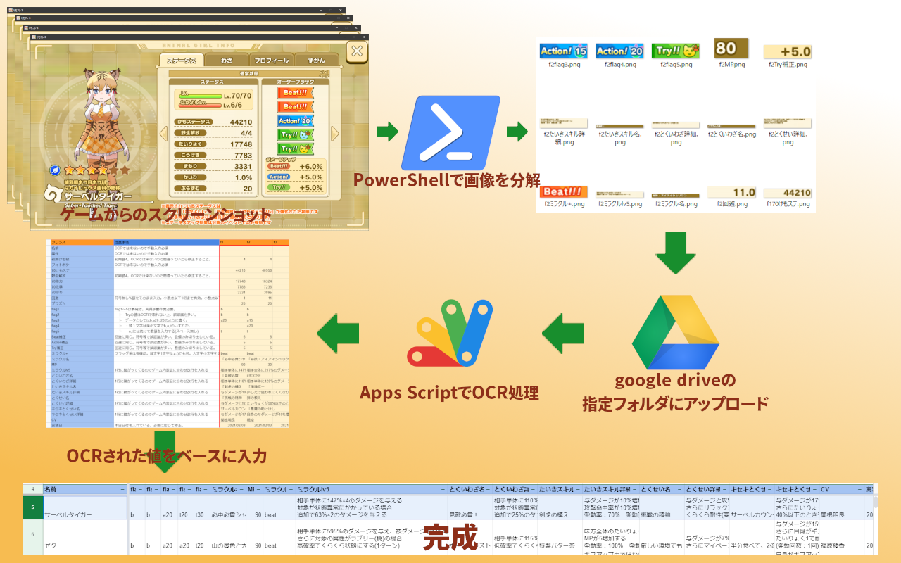

# けものフレンズ 3 ツール OCR ツール

発端: https://twitter.com/dora_bt/status/1356968911967674370

## システム概要

## 説明

上画像の通り、ゲームのスクリーンショットから文字起こしをする目的で作ったシステムです。  
個人的に作ったものでコードも汚いし大したものでもないのですが、詳細を知りたい人がいるようなので公開しておきます。

公開しているのは上の画像のうち PowerShell、Apps Script、結果を書き込むスプレッドシートの３種のみです。  
どれも自作したものの copy なので、**直接これが動作するわけではありません。**  
あくまで同様のシステムを作ろうという人か、画像分解のため PowerShell のスクリプトだけ参考にしたいなとか、そういうコードが読める人向けのものです。

一連の詳細な使い方は下記スプレッドシート（以下 OCR シートと呼ぶ）の help タブに書かれていますのでそちらを参照してください。  
https://docs.google.com/spreadsheets/d/1Xm3_NpFM73fNPU8keec6vLjpBS31HBGIvlJjiTKYmQ4/edit#gid=1448018105

## 各公開ファイル・シートの補足

### [trim.ps1](/trim.ps1)

OCR シートの help シート で手順を見ると判りますが、入出力ファイル名、画像の切り取り座標などはガチガチにハードコードされています。  
また、画像の座標については解像度違いでも受け入れられるよう、px 値ではなく画像に対する割合で指定するというちょっと変なことをしています。

### [ocr.gs](/ocr.gs)

実際には OCR シートのスプリクトエディッタ内に配置しており、画像をアップロード後スプリクトエディッタから直接実行しています（実行ログが見えたほうが都合がよい為）。  
実際にこれを使うには 3 行目の picFolderId に、分解画像アップロード先となる google drive のフォルダ ID(URL の末尾に出てくる英数字列)を指定する必要があります。

### [OCR シート](https://docs.google.com/spreadsheets/d/1Xm3_NpFM73fNPU8keec6vLjpBS31HBGIvlJjiTKYmQ4/edit#gid=1448018105)

処理のメインとなる main シートの他、一連の使い方を一般ユーザー向けに書いた help シート、trim.ps1 の画像座標を求めるために使った計算用シートなどが入っています。
